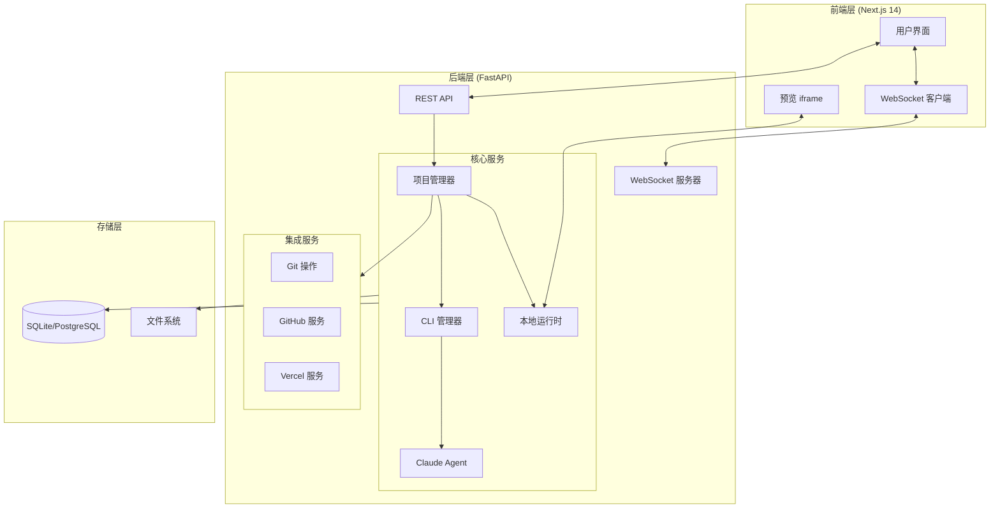
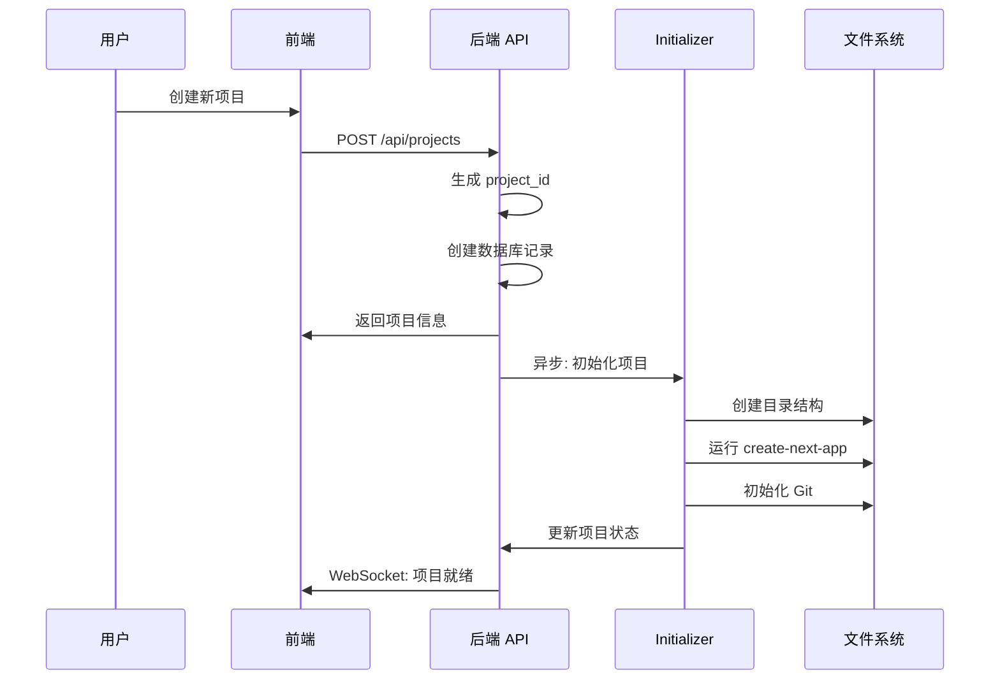
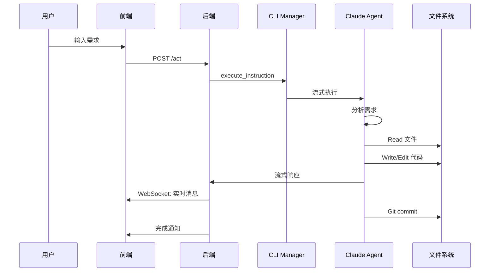
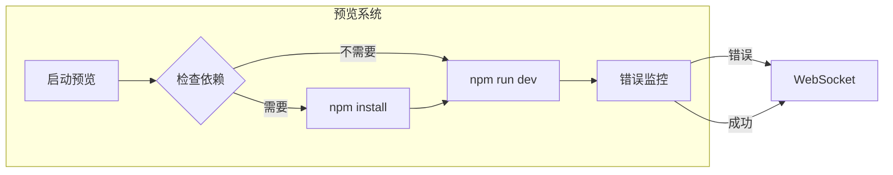
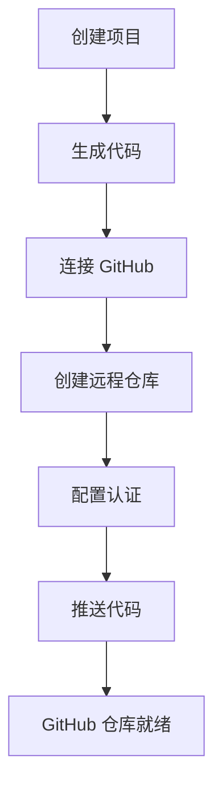
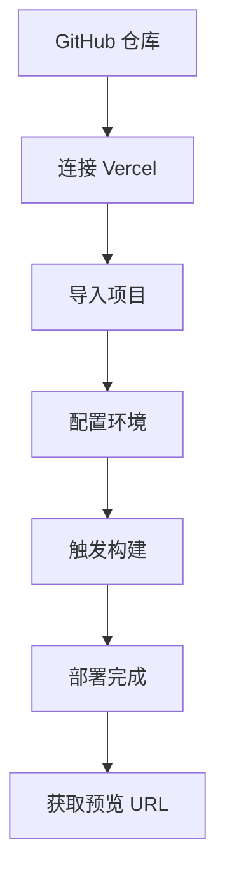

# Claudable Next.js 应用生成架构文档

## 📋 目录

- [项目概述](#项目概述)
- [系统架构](#系统架构)
- [核心工作流程](#核心工作流程)
- [关键组件详解](#关键组件详解)
- [技术特性](#技术特性)
- [API 接口](#api-接口)
- [部署和集成](#部署和集成)

## 项目概述

Claudable 是一个基于 AI 的 Next.js 应用生成平台，通过自然语言描述自动生成完整的 Web 应用。系统集成了 Claude Agent SDK，提供从代码生成到部署的完整工作流。

### 核心能力

- 🤖 **AI 驱动开发**：通过 Claude Agent SDK 理解需求并生成代码
- ⚡ **实时预览**：即时查看生成的应用效果
- 🔄 **热重载**：代码修改自动更新预览
- 📦 **智能依赖管理**：自动安装和缓存 npm 包
- 🔗 **服务集成**：GitHub、Vercel、Supabase 一键集成
- 📝 **版本控制**：自动 Git 提交和历史管理

## 系统架构

### 整体架构图



### 技术栈

| 层级 | 技术 | 用途 |
|------|------|------|
| **前端** | Next.js 14, React 18, TypeScript | 用户界面 |
| **样式** | Tailwind CSS | UI 样式 |
| **后端** | FastAPI, Python 3.10+ | API 服务 |
| **AI** | Claude Agent SDK | 代码生成 |
| **数据库** | SQLAlchemy, SQLite/PostgreSQL | 数据持久化 |
| **实时通信** | WebSocket | 双向通信 |
| **版本控制** | Git | 代码管理 |
| **部署** | GitHub, Vercel | 代码托管和部署 |

## 核心工作流程

### 1. 项目创建流程



### 2. AI 代码生成流程



### 3. 实时预览流程



## 关键组件详解

### 1. 项目初始化器 (`/services/project/initializer.py`)

#### 目录结构

```
/data/projects/{project_id}/
├── repo/                 # Next.js 项目代码
│   ├── src/             # 源代码
│   │   └── app/         # App Router
│   ├── public/          # 静态资源
│   ├── package.json     # 依赖配置
│   └── .git/            # Git 仓库
├── assets/              # 用户上传资源
└── data/
    └── metadata/        # 项目元数据
```

#### 初始化步骤

```python
def initialize_project(project_id: str, name: str) -> str:
    # 1. 创建项目目录
    project_path = create_directories(project_id)

    # 2. 生成 Next.js 脚手架
    scaffold_nextjs_minimal(project_path)

    # 3. 初始化 Git 仓库
    init_git_repo(project_path)

    # 4. 配置环境变量
    write_env_file(project_path, env_content)

    # 5. 设置 Claude 配置
    setup_claude_config(project_path)

    return project_path
```

### 2. Claude Agent 适配器 (`/services/cli/adapters/claude_agent.py`)

#### 配置选项

| 配置项 | 说明 | 默认值 |
|--------|------|--------|
| `system_prompt` | AI 系统提示 | 从文件加载 |
| `model` | 使用的模型 | claude-sonnet-4-5 |
| `allowed_tools` | 允许的工具 | Read, Write, Edit, Bash 等 |
| `permission_mode` | 权限模式 | bypassPermissions |
| `continue_conversation` | 续接会话 | true |

#### 工具权限管理

```python
# 初始提示时的工具配置
if is_initial_prompt:
    allowed_tools = [
        "Read",      # 读取文件
        "Write",     # 创建文件
        "Edit",      # 编辑文件
        "MultiEdit", # 批量编辑
        "Bash",      # 执行命令
        "Glob",      # 文件搜索
        "Grep",      # 内容搜索
    ]
    disallowed_tools = ["TodoWrite"]  # 禁用任务管理
```

### 3. 本地运行时 (`/services/local_runtime.py`)

#### 预览服务器管理

```python
def start_preview_process(project_id: str, repo_path: str, port: int = None):
    # 1. 端口分配
    port = find_free_preview_port()  # 3000-3999

    # 2. 依赖检查
    if _should_install_dependencies(repo_path):
        subprocess.run(["npm", "install"])
        _save_install_hash(repo_path)

    # 3. 启动开发服务器
    process = subprocess.Popen(
        ["npm", "run", "dev", "--", "-p", str(port)],
        cwd=repo_path,
        stdout=subprocess.PIPE
    )

    # 4. 错误监控
    start_error_monitoring(project_id, process)

    return process_name, port
```

#### 智能依赖缓存

```python
def _should_install_dependencies(repo_path: str) -> bool:
    # 计算 package.json 的 MD5 hash
    current_hash = calculate_package_hash()

    # 对比存储的 hash
    stored_hash = read_stored_hash()

    # 仅在变化时返回 True
    return current_hash != stored_hash
```

### 4. WebSocket 管理器 (`/core/websocket/manager.py`)

#### 消息类型

| 类型 | 说明 | 数据结构 |
|------|------|----------|
| `project_status` | 项目状态更新 | `{status, message}` |
| `message` | 聊天消息 | `{role, content, metadata}` |
| `preview_error` | 预览错误 | `{error, context, timestamp}` |
| `preview_success` | 构建成功 | `{message, timestamp}` |
| `act_start` | 执行开始 | `{session_id, instruction}` |
| `act_complete` | 执行完成 | `{status, session_id}` |
| `commit` | Git 提交 | `{hash, message, files}` |

## 技术特性

### 1. 流式响应处理

```python
async def execute_with_streaming():
    async for message in claude_agent.stream():
        # 实时处理每条消息
        save_to_database(message)
        await websocket.send(message)

        if message.has_changes:
            git_commit(changes)
```

### 2. 错误监控系统

```python
error_patterns = [
    "Build Error",
    "Failed to compile",
    "Module not found",
    "TypeError:",
    "ReferenceError:"
]

def monitor_preview_errors(process):
    while process.running:
        line = process.stdout.readline()
        for pattern in error_patterns:
            if pattern in line:
                send_error_via_websocket(line)
```

### 3. 会话管理

```python
# 会话续接机制
if existing_session_id:
    options.resumeSessionId = existing_session_id

# 会话 ID 存储
session_mapping[project_id] = session_id
```

## API 接口

### 项目管理

| 端点 | 方法 | 说明 |
|------|------|------|
| `/api/projects` | GET | 获取项目列表 |
| `/api/projects` | POST | 创建新项目 |
| `/api/projects/{id}` | GET | 获取项目详情 |
| `/api/projects/{id}` | PUT | 更新项目 |
| `/api/projects/{id}` | DELETE | 删除项目 |

### AI 交互

| 端点 | 方法 | 说明 |
|------|------|------|
| `/api/projects/{id}/act` | POST | 执行 AI 指令 |
| `/api/projects/{id}/chat` | POST | 聊天模式 |

### 预览管理

| 端点 | 方法 | 说明 |
|------|------|------|
| `/api/projects/{id}/preview/start` | POST | 启动预览 |
| `/api/projects/{id}/preview/stop` | POST | 停止预览 |
| `/api/projects/{id}/preview/status` | GET | 预览状态 |
| `/api/projects/{id}/preview/logs` | GET | 获取日志 |

### 集成服务

| 端点 | 方法 | 说明 |
|------|------|------|
| `/api/projects/{id}/github/connect` | POST | 连接 GitHub |
| `/api/projects/{id}/github/push` | POST | 推送代码 |
| `/api/projects/{id}/vercel/deploy` | POST | 部署到 Vercel |

## 部署和集成

### GitHub 集成流程



### Vercel 部署流程



## 性能优化

### 1. 并发处理

- **多项目并行**：支持同时处理多个项目
- **异步任务队列**：后台任务不阻塞主线程
- **流式响应**：实时推送 AI 生成进度

### 2. 缓存策略

| 缓存类型 | 说明 | 实现 |
|----------|------|------|
| 依赖缓存 | npm 包缓存 | MD5 hash 对比 |
| 会话缓存 | Claude 会话 | session_id 复用 |
| 日志缓存 | 错误日志 | 内存缓存去重 |

### 3. 资源管理

```python
# 进程清理
def cleanup_project_resources(project_id):
    stop_preview_process(project_id)
    clear_logs(project_id)
    cleanup_cache(project_id)

# 端口管理
def find_free_preview_port():
    for port in range(3000, 4000):
        if is_port_free(port):
            return port
```

## 最佳实践

### 1. 错误处理

```python
try:
    # 执行操作
    result = await execute_operation()
except CLIError as e:
    # CLI 级别错误
    handle_cli_error(e)
except APIError as e:
    # API 级别错误
    handle_api_error(e)
finally:
    # 清理资源
    cleanup_resources()
```

### 2. 状态管理

```python
# 使用数据库事务确保状态一致性
with db.begin():
    update_project_status()
    save_messages()
    update_connections()
```

### 3. 日志记录

```python
# 结构化日志
logger.info("Operation completed", extra={
    "project_id": project_id,
    "duration": duration,
    "status": "success"
})
```

## 故障排除

### 常见问题

| 问题 | 原因 | 解决方案 |
|------|------|----------|
| 预览无法启动 | 端口占用 | 自动分配新端口 |
| 依赖安装失败 | 网络问题 | 重试机制 |
| AI 响应超时 | 请求过于复杂 | 分解为小任务 |
| Git 推送失败 | 认证问题 | 检查 token |

### 调试技巧

1. **启用详细日志**
   ```python
   ui.debug("Detailed info", "Component")
   ```

2. **WebSocket 消息追踪**
   ```python
   print(f"[WS] {message_type}: {data}")
   ```

3. **进程状态检查**
   ```bash
   curl http://localhost:8080/api/processes
   ```

## 扩展性

### 添加新的 CLI 适配器

```python
class NewCLI(BaseCLI):
    def __init__(self):
        super().__init__(CLIType.NEW)

    async def check_availability(self):
        # 实现可用性检查
        pass

    async def execute_with_streaming(self):
        # 实现流式执行
        pass
```

### 支持新的框架

```python
def scaffold_vue_project(repo_path):
    # Vue.js 项目脚手架
    subprocess.run(["npm", "create", "vue@latest"])

def scaffold_react_project(repo_path):
    # React 项目脚手架
    subprocess.run(["npx", "create-react-app"])
```

## 总结

Claudable 通过整合 AI 代码生成、实时预览、版本控制和云部署，实现了从自然语言到生产级 Next.js 应用的全自动化工作流。系统架构模块化、可扩展，为 AI 驱动的应用开发提供了完整解决方案。

---

*最后更新: 2024*