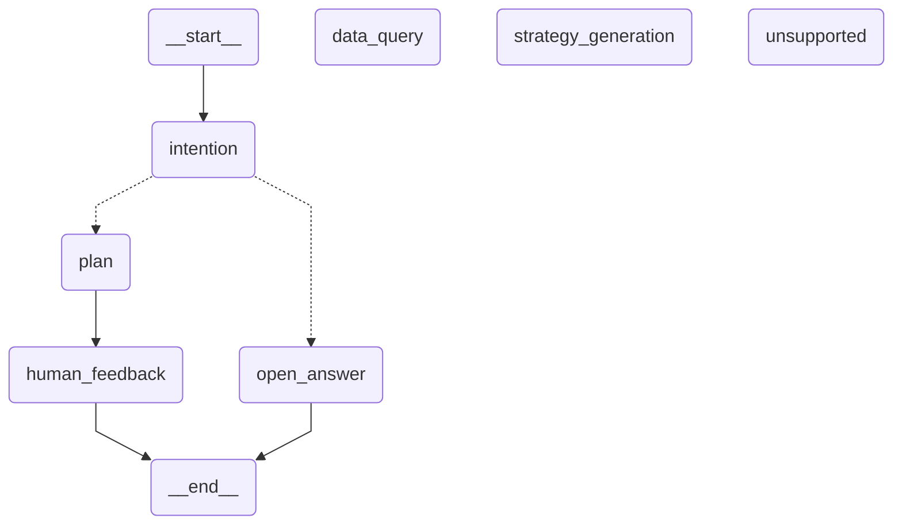

```mermaid
---
config:
  flowchart:
    curve: linear
---
graph TD;
	__start__(<p>__start__</p>)
	intention(intention)
	open_answer(open_answer)
	plan(plan)
	human_feedback(human_feedback)
	data_query(data_query)
	strategy_generation(strategy_generation)
	unsupported(unsupported)
	__end__(<p>__end__</p>)
	__start__ --> intention;
	intention -.-> open_answer;
	intention -.-> plan;
	plan --> human_feedback;
	human_feedback --> __end__;
	open_answer --> __end__;
	classDef default fill:#f2f0ff,line-height:1.2
	classDef first fill-opacity:0
	classDef last fill:#bfb6fc

```